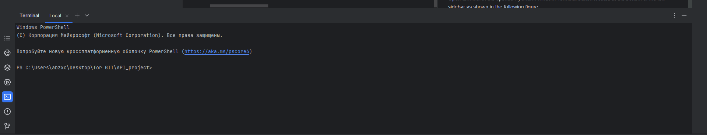
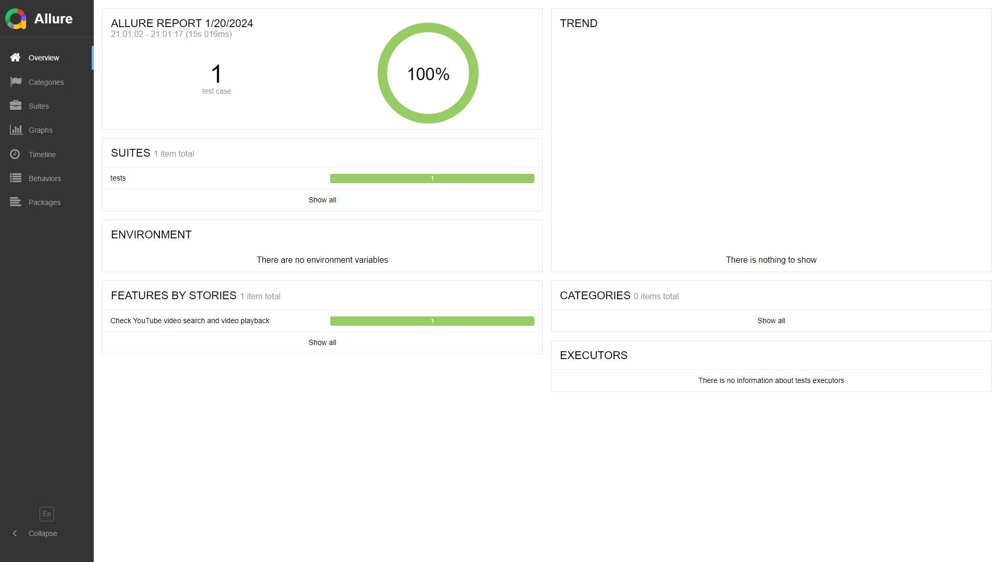
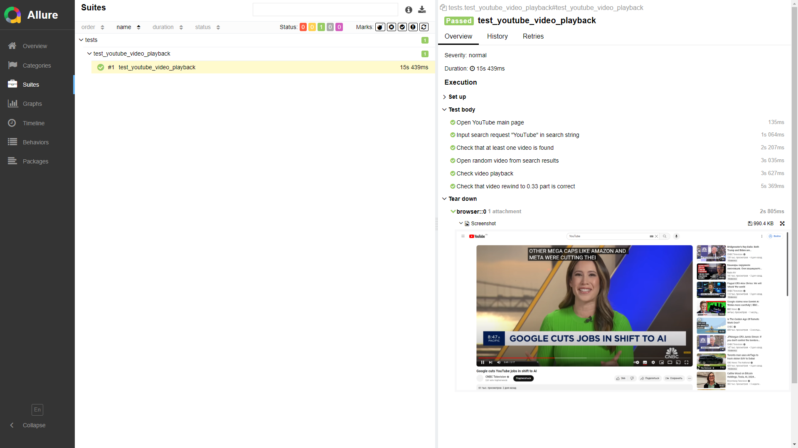

<h1 align="center">YOUTUBE PLAYBACK AND REWIND TESTING PROJECT</h1>  
<p align="center">
    <a href="https://www.youtube.com/">
        
    </a>
</p>

<h2 align="center">Used stack</h2>
<p align="center">
    <a href="https://www.python.org/">
        
    </a>
    <a href="https://www.jetbrains.com/pycharm/">
        
    </a>
    <a href="https://www.selenium.dev/documentation/webdriver/">
        
    </a>
    <a href="https://docs.pytest.org/">
        
    </a>
    <a href="https://git-scm.com/">
        
    </a>
    <a href="https://allurereport.org/">
        
    </a>
</p>  

<h2 align="center">Content</h2>  

* [Description](#description)  
* [Tests launch](#tests-launch)  
    * [Preparing the environment](#preparing-the-environment)  
    * [Launch](#launch)  
    * [Generating a test report](#generating-a-test-report)  
    * [Tests options](#tests-options)  

## Description

Tests are developed using [Python](https://www.python.org/) programming language, [Selenium WebDriver](https://www.selenium.dev/documentation/webdriver/) and [PyTest](https://docs.pytest.org/) frameworks. Reports are generated by [Allure Report](https://allurereport.org/).  
In this project we check the following:  
* Video search.  
* Opening a video from search results that matches search request.  
* Checking video playback.  
* Checking video rewind.  

**ATTENTION!** The project made on Russian Federation territory where YouTube monetization is disabled. Therefore there are no following steps: 
* Closing User agreement window on the main page.
* Skipping advertisements before video starts.

The project will be updated when there will be an opportunity to develop the steps above.  

## Tests launch

### Preparing the environment

Before launch, you need to install the following (installation guide links are provided):  
* [Google Chrome](https://www.google.com/intl/en_us/chrome/).  
* [Mozilla Firefox](https://mozilla.websoftsoft.com/).  
* [PyCharm](https://www.jetbrains.com/pycharm/).  
* [PyTest](https://docs.pytest.org/en/7.4.x/getting-started.html#install-pytest).  
* [Selenium](https://selenium-python.readthedocs.io/installation.html).  
* [Allure Pytest](https://pypi.org/project/allure-pytest/).  

Also, download the repository with this project on your PC/laptop:  
* Click on "**<> Code**" on the [project page](https://github.com/engovadzip/YouTube_UI_project).  
* In the opened pop-up menu click on "**Download ZIP**".  
* Download it to preferred directory and unpack downloaded archive there.  

### Launch

Open any downloaded project's file in PyCharm (right click on file -> Edit with PyCharm). There will be the following window:  
<p align="center">
    
</p>

Click on **Open in Project**. After that there will be a following window:  
<p align="center">
    
</p>

Click on **Trust Project**.  
Open a terminal in the opened PyCharm window by clicking on terminal button. The button locates at the bottom of the left sidebar as shown in the following figure:
<p align="center">
    
</p>
The terminal will open in the bottom of PyCharm as shown in the following figure:
<p align="center">
    
</p>
Launch tests using the following command:  

```
pytest
```

After running the command, Google Chrome will open and tests will start. After the last step of tests (checking video playback after rewind), browser will close. There will be tests result line in terminal when tests will finish. Its example:  
<p align="center">
    
</p>

### Generating a test report

Tests report is generated by Allure Report. To check it, run the following command after tests:  
```
allure serve allure-results
```  
After that, your system's default browser will open and there will be a generated report:
<p align="center">
    
</p>
<p align="center">
    
</p>

###  Tests options

By default, tests' options:  
* "YouTube" search request.  
* Google Chrome browser.  
* 0.33 part of video.  

Also, you can set the options on tests using the following parameters in command line:  
* ```--browser``` sets browser that will be used for tests. There is two options: ```chrome```,  ```firefox``` or ```edge```.
* ```--search``` sets search request that will be used for video search.  
* ```--videopart``` sets part of video to rewind. The values range is 0.00 to 1.00.  

For example, if you want to search "Mr. Beast" videos and rewind it to 0.56 part, run the following command:  
```
pytest --search="Mr. Beast" --videopart="0.56"
```  

If you don't set any option, it will have default value as described above.  